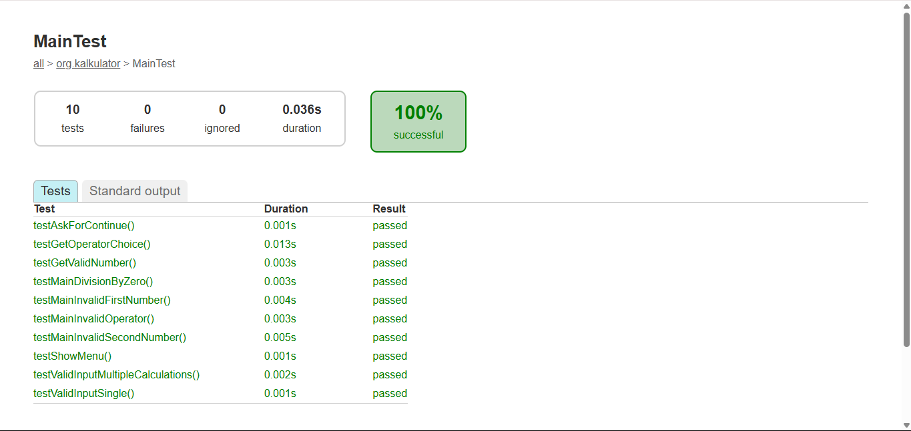

# Aplikasi Kalkulator Sederhana
Aplikasi Kalkulator Sederhana merupakan sebuah program kalkulator yang memungkinkan pengguna untuk melakukan operasi matematika dasar seperti penjumlahan, pengurangan, perkalian, dan pembagian berdasarkan dua buah operand yang diinputkan user. Dengan antarmuka yang mudah digunakan, pengguna dapat dengan cepat memasukkan operand dan memilih operator yang ingin dikalkulasikan. Aplikasi ini juga dilengkapi dengan proses validasi untuk memastikan keakuratan perhitungan yang baik.


## Author 
* Adinda Fauzia Puspita - [221524001]
* Naila Saniyyah Nuraini - [221524024]
* Rahma Divina - [221524026]

## Technologies & Tools 
* **Repository Management** : Git
* **IDE** : Visual Studio Code
* **CLI** : Command Prompt (CMD) / Powershell (Windows)
* **Build Tools** : [](https://gradle.org/)
  Kami menggunakan Tools Gradle untuk mengelola proyek Java kami secara lebih efisien. 
  Versi Gradle yang kelompok kami gunakan adalah 8.13. 
  Untuk informasi lebih lanjut -> [Kunjungi situs Gradle](https://gradle.org/).

* **Programming Language** : [](https://www.java.com/)
  Dalam pengembangan aplikasi kalkulator ini, kami menggunakan bahasa pemrograman Java. 
  Kami memilih bahasa pemrograman ini karena memudahkan dari segi pengembangan dan fungsionalitas yang diharapkan. Banyaknya referensi yang dapat kami gunakan juga menjadi faktor untuk penentuan penggunaan bahasa pemrograman ini.
  Versi java yang kami gunakan adalah Java 21.0.6 2025-01-21 LTS. 
  Untuk informasi lebih lanjut -> [Kunjungi situs Java](https://www.java.com/) untuk informasi lebih lanjut.

* **Unit Testing** : [](https://junit.org/)
  JUnit membantu kami untuk membuat test script dan menjalankan unit test dalam proyek Java Kalkulator sederhana. 
  Versi JUnit yang digunakan adalah JUnit Jupiter 5.9.1. 
  Untuk informasi lebih lanjut -> [Kunjungi situs JUnit](https://junit.org/) untuk informasi lebih lanjut.

### Method Aplikasi
Program kalkulator sederhana kelompok kami diujikan secara metode per-method dengan daftar item uji sebagai berikut:

| No. | Nama Class          | Nama Method         | Jumlah Test Case |
| --- | ------------------- | ------------------- | ---------------- |
| 1   | Main                | main                | 6                |
|     |                     | showMenu            | 1                |
|     |                     | getOperatorChoice   | 1                |
|     |                     | getValidNumber      | 1                |
|     |                     | askForContinue      | 1                |
| 2   | Calculate           | calculate           | 5                |
|     |                     | tambah              | 1                |
|     |                     | kurang              | 1                |
|     |                     | kali                | 1                |
|     |                     | bagi                | 1                |
| 3   | Validation          | validasiInputAngka  | 2                |
|     |                     | validasiInput       | 2                |
|     |                     | validasiOperator    | 1                |
|     |                     | validasiPembagi     | 1                |

## Getting Started 
### How To Use
1. Lakukan instalasi Java JDK min versi 21 atau versi terbarunya (disarankan menggunakan versi 17 atau 21) pada halaman (https://www.oracle.com/id/java/technologies/downloads/) .
2. Lakukan instalasi Gradle (disarankan menggunakan versi 8.13) pada halaman (https://gradle.org/releases/).
3. Pastikan instalasi tersebut berhasil.
4. Tambahkan Java dan Gradle dengan melakukan set environment variables pada desktop anda.
5. Pastikan Java dan Gradle dapat digunakan pada perangkat anda dengan mengetikkan 'java --version' dan 'gradle --version'.
6. Jika sudah berhasil, clone repository ini ke perangkat anda dengan cara:
```
git clone https://github.com/NailaSaniyyahh/Kalkulator-Pengujian-Perangkat-Lunak.git
```
7. Open project yang telah di clone menggunakan IDE favorit Anda. Saya sarankan menggunakan Visual Studio Code agar lebih mudah.

### How To Push Your Change
Untuk melakukan push setiap kali terdapat update atau perubahan kode anda, lakukan dengan step berikut : 
*Notes* Pastikan untuk selalu menjalankan perintah 'git pull' terlebih dahulu saat ingin melakukan perubahan.

1. Tambahkan file yang telah diubah 
```
git add .
```
2. Commit file yang ditambahkan menggunakan keterangan singkat setelah command -m 
```
git commit -m "keterangan singkat terhadap perubahan anda"
```
3. Lalu push commit anda ke repository 
```
git push 
```

### Script For Run Program
Pastikan anda berada dalam direktori src/main/java
```
java org.kalkulator.Main 
```
### Script For Testing Program   
Junit
```
gradle test
```

### Generate Report
Setelah melakukan command untuk testing program kalkulator kami, hasil dan laporan testing tersebut akan di-generate dan disimpan pada lokasi :
```
app\build\reports\tests\test\index.html
```

### Test Report - Testing With Gradle & JUnit
Program kalkulator kami diujikan menggunakan tools Gradle & JUnit untuk memastikan fungsionalitasnya apakah sudah baik dan berjalan sesuai dengan yang diharapkan atau tidak. 

Adapun Hasil dari pengujian sebagai berikut:

  - Jumlah Total Tests: 22
  - Successful: 22
  - Success Rate : 100%
  - Failures : 0
  - Ignored : 0
  - Total Duration : 0.101s

  

Berdasarkan keterangan dari gambar diatas, dapat disimpulkan bahwa dari 22 tests (pengujian) yang tersedia :

  - 6 Tests dari Class CalculateTest
  - 10 Test dari Class MainTest
  - 6 Test dari Class ValidationTest

menghasilkan hasil pengujian dimana seluruhnya dapat dijalankan secara PASSED dibuktikan dengan keterangan pada success rate 100% pada setiap Class. Rincian pengujian pada setiap Class ditunjukkan pada gambar berikut :





Adapun keterangan tambahan lainnya yaitu :

 - Total duration yang dihasilkan adalah 0.038s dengan rincian pada Class CalculateTest 0.050s, MainTest 0.036s dan Class ValidationTest 0.015s	.
 - 0 Failures menunjukkan bahwa tidak ada test script (unit test) yang menghasilkan hasil pengujian berupa FAIL
 - 0 Ignored menunjukkan bahwa tidak ada test script (unit test) yang terlewat atau dihiraukan.

### Test Coverage Report (JaCoCo)
Setelah menjalankan pengujian dengan perintah:
```
gradle test jacocoTestReport
```
Laporan cakupan kode akan dihasilkan secara otomatis dan dapat diakses di:
```
app\build\reports\jacoco\index.html
```


Kelas Main


Kelas Validation


Kelas Calculate

### Ringkasan Hasil Cakupan
- Statement Coverage: 96%
- Branch Coverage: 93%
- Class Coverage: 100%
- Method Coverage: 100%

## Dependencies Used

Kami menambahkan beberapa dependency yang digunakan untuk menunjang kebutuhan program kami untuk dapat dijalankan dengan baik, Dependency tersebut antara lain : 
1. *testImplementation* : 'org.junit.jupiter:junit-jupiter:5.9.1'
    - Digunakan untuk melakukan pengujian (testing) dalam project kami. Dengan dependency ini kami dapat menuliskan unit test apa saja yang ingin diujikan menggunakan fitur-fitur yang disediakan oleh JUnit Jupiter
2. *implementation* : 'com.google.guava:guava:31.1-jre'
    - Digunakan oleh aplikasi kami untuk mendukung class dan utility method yang tidak tersedia dalam JDK Standar. 
